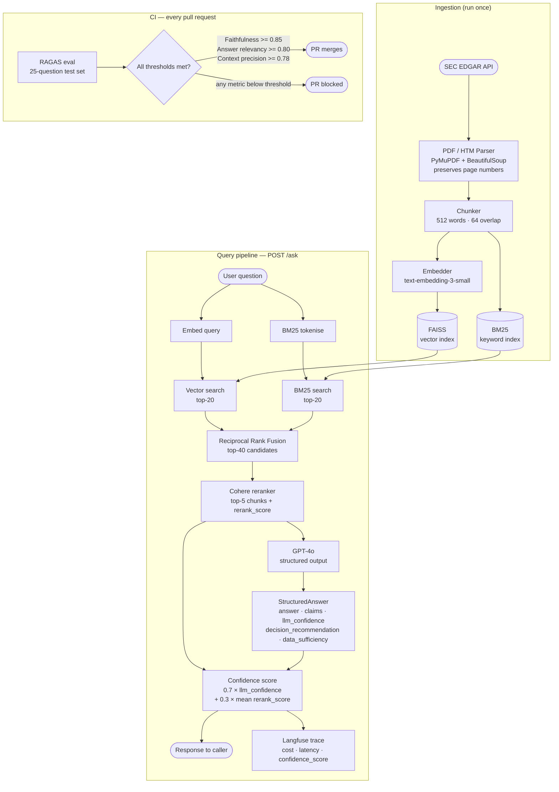
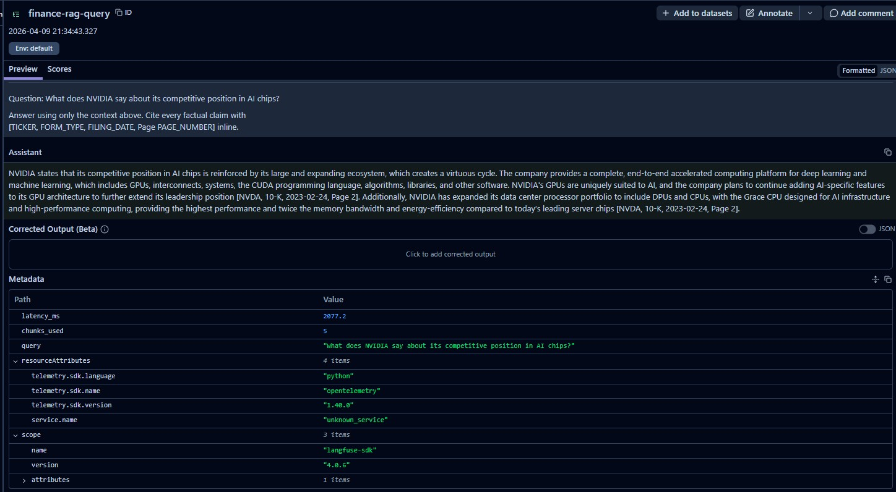

# Finance RAG - Ask My 10-Ks

[](https://github.com/neo-bumblebee-ai/finance-rag/actions/workflows/ci.yml)
[](https://github.com/neo-bumblebee-ai/finance-rag/actions/workflows/eval.yml)
[](https://www.python.org/downloads/)
[](./LICENSE)

> **Part 4 of a 6-month AI engineering series** - building in public, month by month.
>
> <- [Part 3 - Agentic RAG with LangGraph](https://github.com/neo-bumblebee-ai/agentic-rag-langgraph)

---

## What this is

A production-grade RAG system for querying public company filings - 10-Ks and 10-Qs sourced directly from SEC EDGAR.

Ask natural language questions like:

- *"What are Apple's stated risk factors around China supply chain?"*
- *"How did Amazon's AWS revenue grow year over year?"*
- *"What does NVIDIA say about its competitive position in AI chips?"*

Every answer is grounded in the source document and cites the specific filing and page number. No hallucinations. No vague summaries.

---

## Why this is hard (and why most demos get it wrong)

| Problem | Standard RAG | This system |
|---|---|---|
| Ticker symbols (`NVDA`, `JPM`) missed by vector search | Cosine similarity fails on short exact strings | BM25 keyword search catches them |
| Exact financial terms (`EBITDA`, `Basel III`) lost in embedding | Semantic averaging loses precision | Hybrid BM25 + vector with RRF fusion |
| LLM makes up numbers not in the filing | No hallucination guard | Citation enforcement - every claim requires a source |
| Model degrades silently after a code change | No eval, no CI | RAGAS eval gates every PR - blocks on regression |
| No cost or latency visibility | No observability | Langfuse traces every request with cost + latency |
| Unstructured answer, no confidence signal | Free-form text, caller can't assess reliability | Structured output with per-claim citations, confidence score (0-1), and actionable decision recommendation |

---

## Architecture



---

## Benchmark results

Measured on real queries against 1,260 chunks from 12 SEC filings (AAPL, MSFT, AMZN, NVDA).

> **Note:** Latency and cost figures were measured before the structured output / decision support addition. Token counts will be moderately higher now due to the JSON schema included in the system prompt by `beta.chat.completions.parse`.

| Metric | Value |
|--------|-------|
| p50 latency | ~2.1s |
| p95 latency | ~4.2s |
| Cost per query (GPT-4o) | ~$0.02 |
| Avg tokens per query | 3,437 prompt + 187 completion (pre-structured output baseline) |
| Chunks used per answer | 5 |
| Filings indexed | 12 (3 years x 4 companies) |
| Total chunks indexed | 1,260 |

### Observability dashboard

Every query is traced in Langfuse with full input/output, token counts, cost, and latency breakdown.



---

## Example response

```json
{
  "question": "What are Apple's risk factors around China supply chain?",
  "answer": "Apple's risk factors around its China supply chain include concentration of manufacturing in China [AAPL, 10-K, 2023-11-03, Page 3], political and trade risks including tariffs and geopolitical tensions [AAPL, 10-K, 2024-11-01, Page 2], and single-source supplier dependencies that create significant supply and pricing risks [AAPL, 10-K, 2024-11-01, Page 3].",
  "claims": [
    {
      "statement": "Manufacturing is concentrated in China",
      "citation": "[AAPL, 10-K, 2023-11-03, Page 3]"
    },
    {
      "statement": "Tariffs and geopolitical tensions pose political and trade risks",
      "citation": "[AAPL, 10-K, 2024-11-01, Page 2]"
    },
    {
      "statement": "Single-source supplier dependencies create significant supply and pricing risks",
      "citation": "[AAPL, 10-K, 2024-11-01, Page 3]"
    }
  ],
  "confidence_score": 0.871,
  "confidence_reasoning": "Three corroborating chunks from two filing years directly address supply chain concentration and regulatory risk with verbatim figures.",
  "decision_recommendation": "Monitor AAPL's China exposure language across successive 10-K filings; the 2024 filing shows heightened geopolitical risk language relative to 2023.",
  "data_sufficiency": "SUFFICIENT",
  "chunks_used": 5,
  "latency_ms": 2077.2,
  "cost_usd": 0.01999,
  "input_tokens": 3437,
  "output_tokens": 187
}
```

---

## Tech stack

| Component | Tool | Why |
|---|---|---|
| PDF / HTM parsing | PyMuPDF + BeautifulSoup | Preserves page numbers for citations |
| Vector store | FAISS | Fast, no separate service |
| Keyword search | rank_bm25 | Catches tickers and exact financial terms |
| Fusion | Reciprocal Rank Fusion | Merges dense + sparse without weight tuning |
| Reranker | Cohere Rerank API | Precision cross-encoder scoring |
| LLM | GPT-4o | Best faithfulness on financial text |
| Structured output | OpenAI `beta.chat.completions.parse` + Pydantic | Enforces typed schema — claims, confidence, recommendation, data sufficiency |
| API | FastAPI | Async, production-ready |
| Observability | Langfuse | Per-request cost, latency, and confidence score traces |
| Eval | RAGAS | Faithfulness, answer relevancy, context precision |
| CI | GitHub Actions | Eval on every PR, blocks on regression |
| Containers | Docker Compose | Reproducible local + cloud deployment |

---

## Quick start

```bash
git clone https://github.com/neo-bumblebee-ai/finance-rag.git
cd finance-rag

pip install -e ".[dev]"
cp .env.example .env   # add OPENAI_API_KEY, COHERE_API_KEY, LANGFUSE keys

# Step 1: Download 10-K filings from SEC EDGAR and build indexes
python -m src.ingestion.run

# Step 2: Start the API
uvicorn src.api.main:app --port 8000

# Step 3: Ask a question
# Go to http://localhost:8000/docs
```

---

## Project structure

```
finance-rag/
├── src/
│   ├── ingestion/
│   │   ├── edgar_fetcher.py      # SEC EDGAR API downloader
│   │   ├── pdf_parser.py         # PyMuPDF + BS4 chunking with page metadata
│   │   ├── indexer.py            # FAISS + BM25 index builder
│   │   └── run.py                # CLI: fetch -> parse -> index
│   ├── retrieval/
│   │   ├── vector_search.py      # FAISS dense search
│   │   ├── bm25_search.py        # BM25 keyword search
│   │   ├── fusion.py             # Reciprocal rank fusion
│   │   └── reranker.py           # Cohere cross-encoder rerank
│   ├── generation/
│   │   ├── prompt_builder.py     # Citation-enforced prompt templates + decision support guidance
│   │   └── llm_client.py         # GPT-4o structured output, confidence blending, Langfuse tracing
│   ├── api/
│   │   └── main.py               # FastAPI app
│   └── observability/
│       └── langfuse_tracer.py    # Tracing helpers
├── eval/
│   ├── test_set.json             # 25 Q&A pairs with ground truth
│   └── run_ragas.py              # RAGAS eval + CI gate
├── tests/
│   ├── test_retrieval.py         # BM25, RRF, prompt builder, confidence blending tests
│   └── test_ingestion.py         # Chunking, metadata, index tests
├── docs/
│   └── langfuse-traces.png       # Observability dashboard screenshot
├── .github/workflows/
│   ├── ci.yml                    # Lint + tests on every push
│   └── eval.yml                  # RAGAS gate on every PR
├── Dockerfile
├── docker-compose.yml
├── Makefile
├── pyproject.toml
└── .env.example
```

---

## Running tests

```bash
# Unit tests (no API keys needed)
pytest tests/ -v
# or: make test

# Lint
ruff check src/ eval/ tests/
# or: make lint

# Full RAGAS eval (requires API running + keys set)
python eval/run_ragas.py
# or: make eval
```

---

## Series

| Month | Project | Status |
|-------|---------|--------|
| Jan | [Databricks AI Engineering Challenge](https://github.com/neo-bumblebee-ai/databricks-ai-engineering-challenge) | Complete |
| Feb | [Traditional RAG Pipeline](https://github.com/neo-bumblebee-ai/traditional-rag-pipeline) | Complete |
| Mar | [Agentic RAG with LangGraph](https://github.com/neo-bumblebee-ai/agentic-rag-langgraph) | Complete |
| **Apr** | **Finance RAG - Ask My 10-Ks (this repo)** | Complete |
| May | LLMOps Evaluation Platform | Coming |
| Jun | Enterprise AI Platform (Capstone) | Coming |

---

## Author

**Jignesh Patel** - [@neo-bumblebee-ai](https://github.com/neo-bumblebee-ai)

---

## License

[MIT License](./LICENSE)
