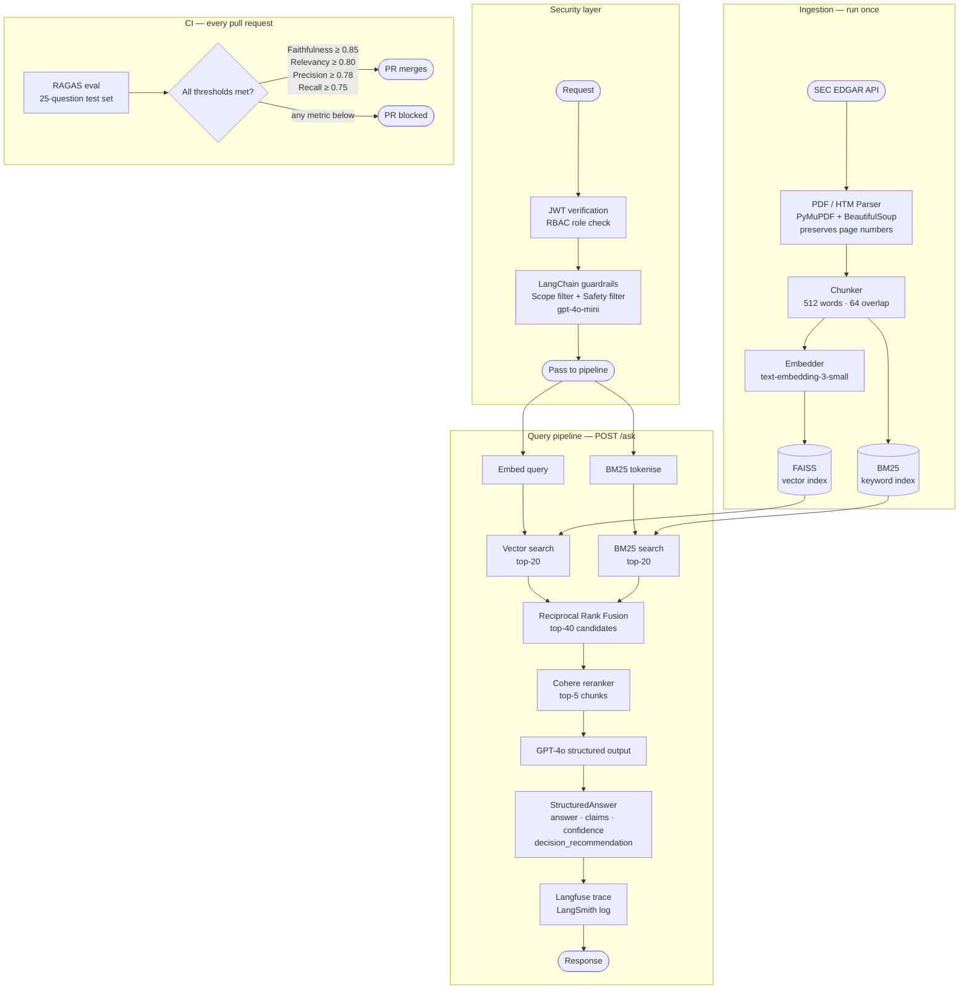

# Finance RAG — Ask My 10-Ks

[](https://github.com/neo-bumblebee-ai/finance-rag/actions/workflows/ci.yml)
[](https://github.com/neo-bumblebee-ai/finance-rag/actions/workflows/eval.yml)
[](https://www.python.org/downloads/)
[](./LICENSE)

> **Part 4 of a 6-month AI engineering series** — building production AI systems in public, month by month.
>
> ← [Part 3 — Agentic RAG with LangGraph](https://github.com/neo-bumblebee-ai/agentic-rag-langgraph)

---

## What this is

A **production-grade RAG system** for querying public company SEC filings — 10-Ks and 10-Qs sourced directly from SEC EDGAR. Ask natural language questions and get cited, structured answers backed by the source document.

```
"What are Apple's stated risk factors around China supply chain?"
→ Answer with inline citations [AAPL, 10-K, 2024-11-01, Page 3],
  confidence score 0.87, and an analyst decision recommendation.
  Every claim has a source. Nothing is made up.
```

This is not a demo. It has JWT authentication, LangChain guardrails, RAGAS eval gates on every PR, dual observability (Langfuse + LangSmith), and a one-command AWS deployment.

---

## Why this is hard (and why most demos get it wrong)

| Problem | Typical RAG demo | This system |
|---|---|---|
| Tickers (`NVDA`, `JPM`) missed by vector search | Cosine similarity fails on short exact strings | BM25 keyword search catches them |
| Financial terms (`EBITDA`, `Basel III`) lost in embedding | Semantic averaging loses precision | Hybrid BM25 + vector with RRF fusion |
| LLM fabricates numbers not in the filing | No hallucination guard | Citation enforcement — every claim requires a source |
| Anyone can query any document | No access control | JWT RBAC — analysts scoped to their coverage universe |
| Off-topic or harmful queries reach the LLM | No filtering | LangChain guardrails block out-of-scope + toxic queries before GPT-4o |
| Model degrades silently after a code change | No eval, no CI | RAGAS gate on every PR — blocks merge on regression |
| Unknown LLM cost | No visibility | Per-request cost tracked in Langfuse + daily aggregates in LangSmith |
| Unstructured answer, no confidence signal | Free-form text | Structured output: claims, confidence score, decision recommendation |

---

## Architecture



---

## Production features

### JWT Role-Based Access Control

Three roles with distinct permissions:

| Role | Can query | Can ingest | Ticker scope |
|---|---|---|---|
| `admin` | Any ticker | Yes | Unrestricted |
| `analyst` | Assigned tickers only | No | e.g., AAPL, MSFT, NVDA |
| `viewer` | Assigned tickers only | No | e.g., AAPL only |

```bash
# Get a token
curl -X POST http://localhost:8000/auth/token \
     -d "username=alice&password=alice-secret"

# Use it
curl -X POST http://localhost:8000/ask \
     -H "Authorization: Bearer <token>" \
     -H "Content-Type: application/json" \
     -d '{"question": "What are Apple'\''s supply chain risks?"}'
```

Tokens expire after 60 minutes. All API keys are injected from AWS Secrets Manager at container start — nothing is stored in code or environment files in production.

### LangChain Guardrails

Every query passes through two filters before reaching GPT-4o:

- **Scope filter** — blocks non-finance questions ("write me a poem", "what's the weather")
- **Safety filter** — blocks toxicity, competitor promotion, market manipulation language

Both run via `gpt-4o-mini` concurrently — cost is ~$0.00008 per query, effectively free.

```json
// Blocked out-of-scope query
{
  "detail": "This question is outside the scope of the Finance RAG system.
             Please ask questions about SEC filings, earnings, risk factors,
             capital structure, or related financial topics."
}
```

### RAGAS Evaluation Gate

Every pull request runs 25 real financial questions through the full pipeline. The PR is blocked if any metric drops below threshold:

| Metric | What it measures | Threshold |
|---|---|---|
| Faithfulness | Every claim supported by retrieved context | ≥ 0.85 |
| Answer relevancy | Answer addresses the question | ≥ 0.80 |
| Context precision | Retrieved chunks are actually useful | ≥ 0.78 |
| Context recall | Retrieval captures all needed context | ≥ 0.75 |

Results are uploaded to LangSmith after each run so you can track metric trends over time.

---

## Example response

```json
{
  "question": "What are Apple's risk factors around China supply chain?",
  "answer": "Apple's risk factors include concentration of manufacturing in China [AAPL, 10-K, 2023-11-03, Page 3], tariff and geopolitical exposure [AAPL, 10-K, 2024-11-01, Page 2], and single-source supplier dependencies [AAPL, 10-K, 2024-11-01, Page 3].",
  "claims": [
    { "statement": "Manufacturing is concentrated in China", "citation": "[AAPL, 10-K, 2023-11-03, Page 3]" },
    { "statement": "Tariffs and geopolitical tensions pose trade risks", "citation": "[AAPL, 10-K, 2024-11-01, Page 2]" },
    { "statement": "Single-source dependencies create supply and pricing risks", "citation": "[AAPL, 10-K, 2024-11-01, Page 3]" }
  ],
  "confidence_score": 0.871,
  "confidence_reasoning": "Three corroborating chunks from two filing years directly address supply chain concentration and regulatory risk.",
  "decision_recommendation": "Monitor AAPL's China exposure language across successive 10-K filings; 2024 shows heightened geopolitical risk language relative to 2023.",
  "data_sufficiency": "SUFFICIENT",
  "chunks_used": 5,
  "latency_ms": 2077.2,
  "cost_usd": 0.01999,
  "queried_by": "alice",
  "role": "analyst"
}
```

---

## Quick start

### Prerequisites

- Python 3.11+
- An [OpenAI API key](https://platform.openai.com)
- A [Cohere API key](https://dashboard.cohere.com) (free tier works)

### 1. Clone and install

```bash
git clone https://github.com/neo-bumblebee-ai/finance-rag.git
cd finance-rag
pip install -e ".[dev]"
```

### 2. Configure environment

```bash
cp .env.example .env
```

Open `.env` and fill in the required keys:

```bash
OPENAI_API_KEY=sk-...          # required
COHERE_API_KEY=...             # required for reranking
JWT_SECRET_KEY=<random-32-chars>  # generate: python -c "import secrets; print(secrets.token_hex(32))"
```

Everything else (Langfuse, LangSmith) is optional — the system runs without them.

### 3. Ingest SEC filings

Downloads 10-K filings from SEC EDGAR and builds FAISS + BM25 indexes.

```bash
make ingest
# or: python -m src.ingestion.run
```

Default tickers: `AAPL MSFT AMZN NVDA JPM` across 2022–2024.

```bash
# Custom tickers / years
python -m src.ingestion.run --tickers TSLA GOOGL --years 2023 2024
```

### 4. Start the API

```bash
make run
# or: uvicorn src.api.main:app --reload --port 8000
```

Open **http://localhost:8000/docs** — the Swagger UI lets you authenticate and run queries interactively.

### 5. Get a token and ask a question

```bash
# Step 1: authenticate (default users: admin / alice / bob — see src/auth/models.py)
TOKEN=$(curl -s -X POST http://localhost:8000/auth/token \
  -d "username=admin&password=admin-secret" | python3 -c "import sys,json; print(json.load(sys.stdin)['access_token'])")

# Step 2: ask
curl -s -X POST http://localhost:8000/ask \
  -H "Authorization: Bearer $TOKEN" \
  -H "Content-Type: application/json" \
  -d '{"question": "What does NVIDIA say about competition in AI chips?"}' | python3 -m json.tool
```

### Docker

```bash
docker-compose up
```

---

## Project structure

```
finance-rag/
├── src/
│   ├── auth/
│   │   ├── models.py             # User model, roles, permission matrix, user store
│   │   └── rbac.py               # JWT creation/validation, FastAPI dependencies
│   ├── guardrails/
│   │   ├── scope_filter.py       # LangChain finance scope classifier (gpt-4o-mini)
│   │   ├── safety_filter.py      # Toxicity + brand safety filter (gpt-4o-mini)
│   │   └── chain.py              # Combined async guardrail chain
│   ├── ingestion/
│   │   ├── edgar_fetcher.py      # SEC EDGAR API downloader
│   │   ├── pdf_parser.py         # PyMuPDF + BS4 chunking with page metadata
│   │   ├── indexer.py            # FAISS + BM25 index builder
│   │   └── run.py                # CLI: fetch → parse → index
│   ├── retrieval/
│   │   ├── vector_search.py      # FAISS dense search
│   │   ├── bm25_search.py        # BM25 keyword search
│   │   ├── fusion.py             # Reciprocal rank fusion
│   │   └── reranker.py           # Cohere cross-encoder rerank
│   ├── generation/
│   │   ├── prompt_builder.py     # Citation-enforced prompt templates
│   │   └── llm_client.py         # GPT-4o structured output, Langfuse + LangSmith tracing
│   ├── api/
│   │   └── main.py               # FastAPI app — all endpoints
│   └── observability/
│       └── langfuse_tracer.py    # Langfuse client helper
├── eval/
│   ├── test_set.json             # 25 Q&A pairs with ground truth
│   └── run_ragas.py              # RAGAS eval + LangSmith upload + CI gate
├── tests/
│   ├── test_retrieval.py         # BM25, RRF, prompt builder, confidence tests
│   └── test_ingestion.py         # Chunking, metadata, index tests
├── deploy/
│   ├── aws/
│   │   ├── cloudformation.yml    # Full AWS stack: VPC, ECS Fargate, ALB, ECR, Secrets Manager
│   │   └── deploy.sh             # One-command build → push → deploy
│   └── monitoring/
│       ├── langsmith_monitor.py  # CLI: daily cost, latency p95, low-confidence query alerts
│       └── cloudwatch_dashboard.json  # Importable CloudWatch dashboard
├── docs/
│   ├── langfuse-traces.png
│   └── stakeholder-presentation-outline.md
├── .github/workflows/
│   ├── ci.yml                    # Lint + unit tests on every push
│   └── eval.yml                  # RAGAS gate on every PR
├── Dockerfile
├── docker-compose.yml
├── Makefile
├── pyproject.toml
└── .env.example
```

---

## Tech stack

| Layer | Tool | Why |
|---|---|---|
| Auth | python-jose + FastAPI OAuth2 | JWT RBAC, role-scoped ticker access |
| Guardrails | LangChain + gpt-4o-mini | Finance scope + safety filtering before GPT-4o |
| PDF / HTM parsing | PyMuPDF + BeautifulSoup | Preserves page numbers for citations |
| Vector store | FAISS | Fast local search, no separate service |
| Keyword search | rank_bm25 | Catches tickers and exact financial terms |
| Fusion | Reciprocal Rank Fusion | Merges dense + sparse without weight tuning |
| Reranker | Cohere Rerank API | Cross-encoder precision on top-40 candidates |
| LLM | GPT-4o | Best faithfulness on financial text |
| Structured output | OpenAI `beta.chat.completions.parse` + Pydantic | Enforces typed schema — no free-form hallucinations |
| API | FastAPI | Async, auto-documented, production-ready |
| Observability | Langfuse | Per-request cost, latency, confidence score |
| Eval tracking | LangSmith | Dataset versioning, RAGAS metric trends over time |
| Eval framework | RAGAS | Faithfulness, relevancy, precision, recall |
| CI | GitHub Actions | Eval gate on every PR — blocks on regression |
| Deployment | AWS ECS Fargate + CloudFormation | Auto-scaling, zero-downtime deploys, Secrets Manager |
| Containers | Docker Compose | Reproducible local + cloud |

---

## Running tests

```bash
make test        # unit tests (no API keys needed)
make lint        # ruff check
make eval        # full RAGAS eval (requires API running)
```

---

## GitHub Actions CI

Two workflows run automatically:

**`ci.yml`** — runs on every push and pull request
- Lints with `ruff`
- Runs unit tests with `pytest` (no API keys needed)

**`eval.yml`** — runs on every pull request to `main`
- Starts the API in the background
- Runs 25 financial questions through the full pipeline
- Scores with RAGAS (faithfulness, relevancy, precision, recall)
- Uploads results to LangSmith if `LANGCHAIN_API_KEY` is set
- Blocks the PR if any metric drops below threshold

**Required GitHub secrets:**

| Secret | Where to get it |
|---|---|
| `OPENAI_API_KEY` | platform.openai.com |
| `COHERE_API_KEY` | dashboard.cohere.com |

**Optional secrets** (enable additional observability):

| Secret | Purpose |
|---|---|
| `LANGCHAIN_API_KEY` | LangSmith eval trend tracking |
| `LANGFUSE_SECRET_KEY` | Langfuse per-request tracing |
| `LANGFUSE_PUBLIC_KEY` | Langfuse per-request tracing |

---

## Deploying to AWS

Full infrastructure is defined in `deploy/aws/cloudformation.yml`:
- ECS Fargate in private subnets (2 tasks minimum, scales to 10)
- Application Load Balancer with HTTPS (HTTP → HTTPS redirect)
- All secrets injected from AWS Secrets Manager at container start
- CloudWatch alarms: p95 latency > 5s, 5xx error rate
- Deployment circuit breaker — failed deploys auto-rollback

```bash
# Prerequisites: AWS CLI configured, secrets created in Secrets Manager, ACM cert issued
export AWS_ACCOUNT_ID=123456789012
export AWS_REGION=us-east-1
export CERTIFICATE_ARN=arn:aws:acm:...
export OPENAI_SECRET_ARN=arn:aws:secretsmanager:...
export COHERE_SECRET_ARN=arn:aws:secretsmanager:...
export JWT_SECRET_ARN=arn:aws:secretsmanager:...
export LANGSMITH_SECRET_ARN=arn:aws:secretsmanager:...
export LANGFUSE_SECRET_ARN=arn:aws:secretsmanager:...

./deploy/aws/deploy.sh production
```

---

## Monitoring

```bash
# Daily cost + latency + confidence report (requires LANGCHAIN_API_KEY)
python deploy/monitoring/langsmith_monitor.py --days 7

# Sample output:
# Total spend          : $0.1847
# By user:
#   alice                           $0.0923
#   admin                           $0.0924
# p50 latency          : 2,103 ms
# p95 latency          : 4,287 ms   [OK vs 5s SLA]
# Low-confidence queries (< 0.6) : 2
```

The CloudWatch dashboard (`deploy/monitoring/cloudwatch_dashboard.json`) can be imported directly into AWS Console and shows request count, p95 latency with SLA line, 5xx errors, healthy task count, and ECS CPU/memory.

---

## Performance

Measured on 1,260 chunks from 12 SEC filings (AAPL, MSFT, AMZN, NVDA — 3 years each):

| Metric | Value |
|---|---|
| p50 latency | ~2.1s |
| p95 latency | ~4.2s |
| Cost per query (GPT-4o) | ~$0.02 |
| Guardrail overhead (gpt-4o-mini) | ~$0.00008 per query |
| Chunks retrieved per answer | 5 |
| Filings indexed | 12 |
| Total chunks indexed | 1,260 |

---

## Customising for your use case

**Different tickers / filing types:**
```bash
python -m src.ingestion.run --tickers TSLA GOOGL META --form-type 10-Q --years 2024
```

**Adding users and roles** — edit `_USER_STORE` in `src/auth/models.py`. In production, replace this with a database-backed `UserRepository`.

**Adjusting RAGAS thresholds** — edit `THRESHOLDS` in `eval/run_ragas.py`.

**Disabling guardrails locally** — set `GUARDRAILS_DISABLED=true` in your `.env` (useful during development).

---

## Series

| Month | Project | Status |
|---|---|---|
| Jan | [Databricks AI Engineering Challenge](https://github.com/neo-bumblebee-ai/databricks-ai-engineering-challenge) | Complete |
| Feb | [Traditional RAG Pipeline](https://github.com/neo-bumblebee-ai/traditional-rag-pipeline) | Complete |
| Mar | [Agentic RAG with LangGraph](https://github.com/neo-bumblebee-ai/agentic-rag-langgraph) | Complete |
| **Apr** | **Finance RAG — Ask My 10-Ks (this repo)** | **Complete** |
| May | LLMOps Evaluation Platform | Coming |
| Jun | Enterprise AI Platform (Capstone) | Coming |

---

## Author

**Jignesh Patel** — [@neo-bumblebee-ai](https://github.com/neo-bumblebee-ai)

---

## License

[MIT License](./LICENSE)
